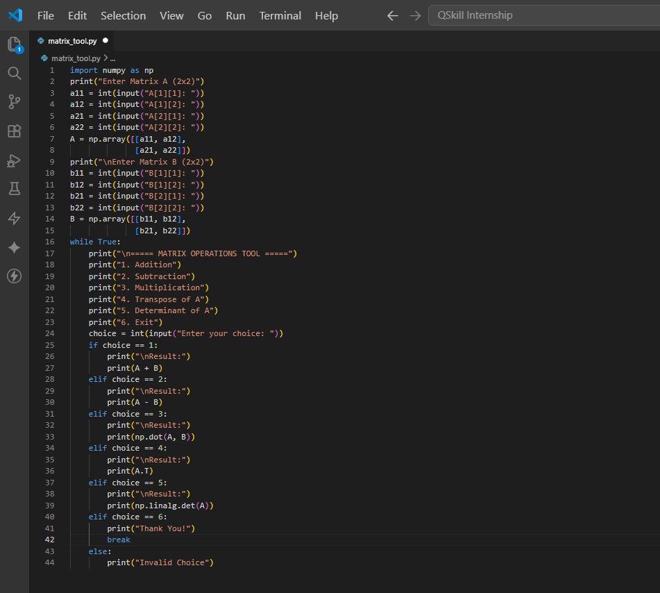

# 🔢 Matrix Operations Tool using Python & NumPy

A Python-based Matrix Operations Tool that performs essential matrix calculations using NumPy. This project demonstrates matrix manipulation, numerical computation, and linear algebra concepts through an interactive command-line application.

---

## 🚀 Project Overview

Matrix operations play a vital role in Machine Learning, Data Science, Artificial Intelligence, Computer Graphics, and Scientific Computing.

This project allows users to perform various matrix operations efficiently using Python and NumPy.

### Features

* Matrix Addition
* Matrix Subtraction
* Matrix Multiplication
* Matrix Transpose
* Matrix Determinant Calculation

---

## 🛠️ Technologies Used

* Python
* NumPy
* VS Code

---

## 📂 Project Structure

```text
Matrix-Operations-Python/
│
├── screenshots/
│   ├── matrix_tool_code.png
│   ├── Addition.png
│   ├── Subtraction.png
│   ├── Multiplication.png
│   ├── Transpose.png
│   └── Determinant.png
│
├── matrix_tool.py
├── Matrix_Operations_Report.pdf
├── Matrix_Operations_Report.docx
└── README.md
```

---

## 💻 Source Code

### Matrix Operations Tool Implementation



The application is implemented using NumPy arrays and matrix functions to perform efficient mathematical computations.

---

## 📊 Results

### Matrix Addition


**Result:** Successfully performs addition between two matrices of equal dimensions.

---

### Matrix Subtraction


**Result:** Calculates the difference between corresponding matrix elements.

---

### Matrix Multiplication


**Result:** Performs matrix multiplication according to standard mathematical rules.

---

### Matrix Transpose


**Result:** Converts rows into columns and columns into rows.

---

### Matrix Determinant


**Result:** Computes the determinant of a square matrix using NumPy's built-in functions.

---

## 🎯 Learning Outcomes

This project helped develop practical knowledge of:

* Matrix Mathematics
* Linear Algebra Fundamentals
* NumPy Arrays
* Numerical Computing
* Python Programming
* Scientific Computing

---

## ▶️ Installation & Usage

```bash
git clone https://github.com/charanyadavkandhi/Matrix-Operations-Python.git

cd Matrix-Operations-Python

pip install numpy

python matrix_tool.py
```

---

## 📈 Applications

* Machine Learning
* Artificial Intelligence
* Data Science
* Computer Graphics
* Engineering Simulations
* Scientific Research

---

## 🔮 Future Enhancements

* Matrix Inverse Calculation
* Eigenvalue & Eigenvector Computation
* Matrix Rank Calculation
* Graphical User Interface (GUI)
* Web-Based Matrix Calculator

---

## 👨‍💻 Author

**Kandhi Charan Yadav**

🎓 B.Tech Computer Science Engineering, SR University

🔗 GitHub: https://github.com/charanyadavkandhi

🔗 LinkedIn: https://www.linkedin.com/in/kandhicharanyadav/

---

⭐ If you found this project useful, consider giving it a star.
