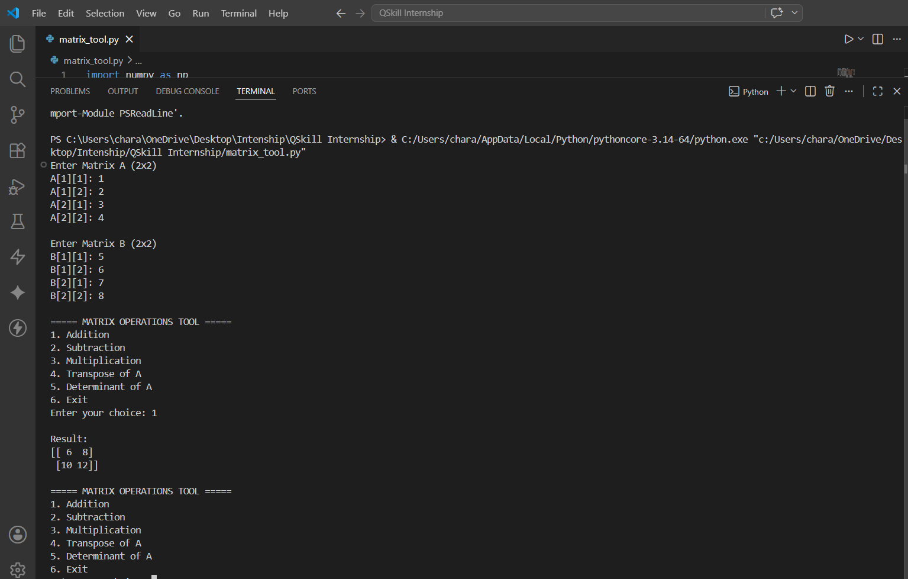
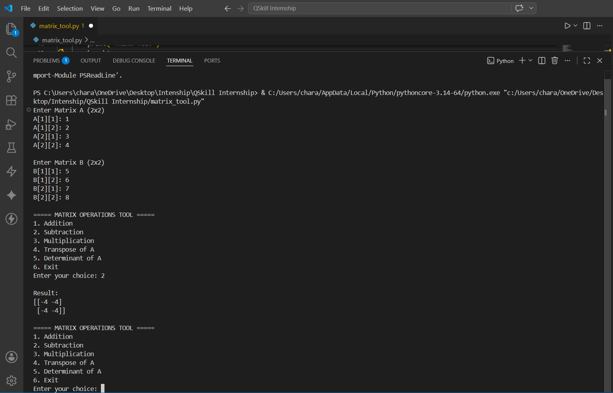
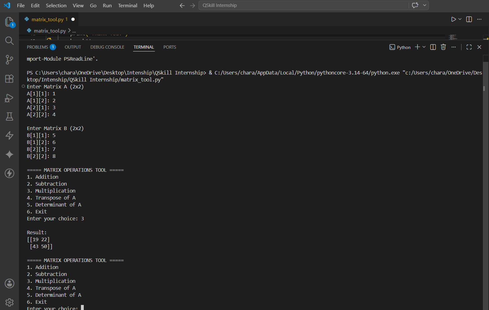
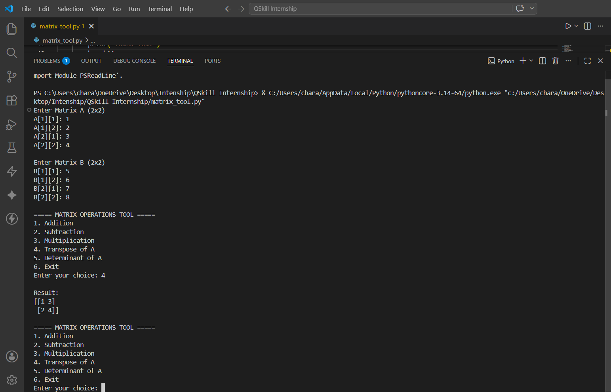
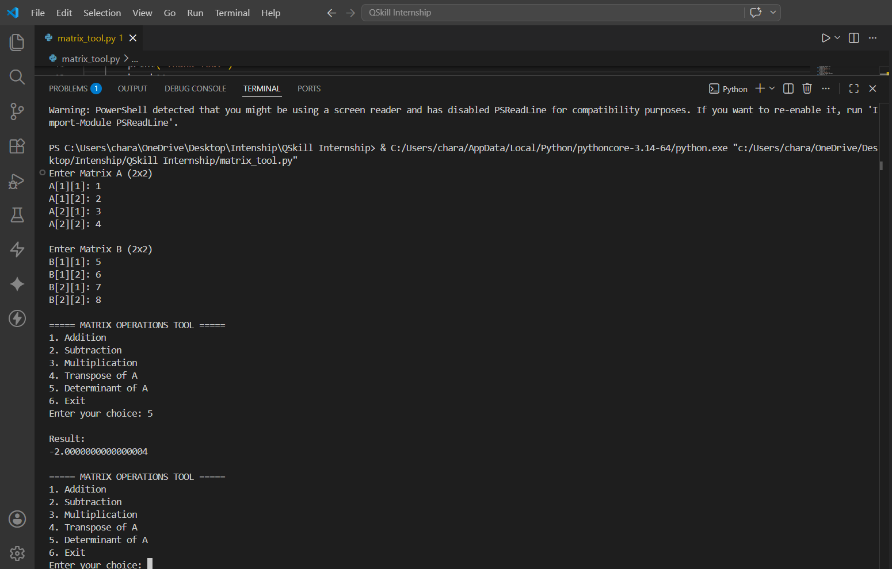

# 🔢 Matrix Operations Tool using Python & NumPy

A Python-based Matrix Operations Tool that performs fundamental matrix calculations using NumPy. This project demonstrates mathematical computing, matrix manipulation, and numerical analysis through an interactive command-line application.

---

## 🚀 Project Overview

Matrix operations are widely used in Data Science, Machine Learning, Computer Graphics, Engineering, and Scientific Computing.

This project provides an easy-to-use tool for performing common matrix operations such as:

* Matrix Addition
* Matrix Subtraction
* Matrix Multiplication
* Matrix Transpose
* Matrix Determinant Calculation

The project is implemented using Python and NumPy to ensure efficient matrix computations.

---

## 🛠️ Technologies Used

| Technology | Purpose                                   |
| ---------- | ----------------------------------------- |
| Python     | Core Programming Language                 |
| NumPy      | Matrix Computation & Numerical Operations |
| VS Code    | Development Environment                   |

---

## 📂 Project Structure

```text
Matrix-Operations-Python/
│
├── screenshots/
│   ├── Matrix Operations Tool (NumPy) -Code.png
│   ├── Addition.png
│   ├── Subtraction.png
│   ├── Multiplication.png
│   ├── Transpose.png
│   └── Determinant.png
│
├── matrix_tool.py
├── Matrix_Operations_Report.pdf
├── Matrix_Operations_Report.docx
└── README.md
```

---

## ✨ Features

✅ Matrix Addition

✅ Matrix Subtraction

✅ Matrix Multiplication

✅ Matrix Transpose

✅ Determinant Calculation

✅ Fast Computation using NumPy

✅ User-Friendly Command-Line Interface

---

## 💻 Source Code

### Matrix Operations Tool Implementation


This implementation utilizes NumPy arrays and built-in matrix functions for efficient calculations.

---

## 📊 Results

### Matrix Addition



**Result:** Successfully performs addition of two matrices of the same dimensions.

---

### Matrix Subtraction



**Result:** Calculates the difference between corresponding matrix elements.

---

### Matrix Multiplication



**Result:** Performs matrix multiplication following standard mathematical rules.

---

### Matrix Transpose



**Result:** Converts matrix rows into columns and columns into rows.

---

### Matrix Determinant



**Result:** Computes the determinant of a square matrix using NumPy functions.

---

## 🎯 Learning Outcomes

Through this project, the following concepts were explored:

* Matrix Mathematics
* NumPy Array Operations
* Python Programming
* Mathematical Computing
* Linear Algebra Fundamentals
* Scientific Computing

---

## ▶️ How to Run

```bash
git clone https://github.com/charanyadavkandhi/Matrix-Operations-Python.git

cd Matrix-Operations-Python

pip install numpy

python matrix_tool.py
```

---

## 📈 Applications

* Data Science
* Machine Learning
* Artificial Intelligence
* Computer Graphics
* Engineering Simulations
* Scientific Research

---

## 🔮 Future Enhancements

* Graphical User Interface (GUI)
* Matrix Inverse Calculation
* Eigenvalues & Eigenvectors
* Matrix Rank Computation
* Web-Based Matrix Calculator

---

## 👨‍💻 Author

**Kandhi Charan Yadav**

🎓 B.Tech Computer Science Engineering, SR University

🔗 GitHub: https://github.com/charanyadavkandhi

🔗 LinkedIn: https://www.linkedin.com/in/kandhicharanyadav/

---

⭐ If you found this project useful, consider giving it a star.
